# Oracle 3.0 Master Plan

> **Vision:** A persistent, reliable, and intelligent field assistant accessible via SMS, Obsidian, and future integrations. The "Girl in the Chair" for any adventure.

---

## ⚠️ CRITICAL LESSONS LEARNED (2026-01-19)

| Component | Issue | Fix |
|-----------|-------|-----|
| `google.generativeai` | 404 errors - v1beta API deprecated | Migrated to `google-genai` package |
| `sms_server.py` | Image/Audio analysis broken | Updated to `types.Part.from_bytes` |
| `cloud_brain/main.py` | Intent parsing broken | Updated to `client.models.generate_content` |
| `requirements.txt` | Wrong package | Changed `google-generativeai` → `google-genai` |

### Working Pattern (google-genai)
```python
from google import genai
from google.genai import types

client = genai.Client(api_key=API_KEY)
response = client.models.generate_content(
    model="gemini-2.0-flash",
    contents=[prompt, types.Part.from_bytes(data=media, mime_type="image/jpeg")]
)
```

---

## Current Architecture (Post-Rescue)

```mermaid
graph TD
    subgraph "Field (Mobile)"
        SMS[📱 Samsung S23 Ultra]
    end

    subgraph "Cloud (Railway)"
        CloudBrain[☁️ cloud_brain\nFastAPI]
        Supabase[(Supabase DB)]
    end

    subgraph "Local (ProArt PX13)"
        NgrokTunnel[🔗 Ngrok Tunnel]
        SMSServer[📡 sms_server.py\nFlask:5050]
        PipCore[🧠 pip_core.py\nRouter]
        LLM[💬 llm_layer.py\nGemini 2.0]
        Brain[📚 brain_v3.py\nRAG Cache]
        Worker[👷 pip_worker.py]
    end

    SMS -- Twilio --> CloudBrain
    CloudBrain -- Queue --> Supabase
    Worker -- Poll --> Supabase
    Worker -- Execute --> PipCore

    SMS -. Ngrok Bypass .-> NgrokTunnel
    NgrokTunnel --> SMSServer
    SMSServer --> PipCore
    PipCore --> LLM
    PipCore --> Brain
```



| Component | Status | Tech |
|-----------|--------|------|
| SMS Receiver (Local) | ✅ Live | Flask + Ngrok + Twilio |
| SMS Receiver (Cloud) | ✅ Live | FastAPI + Railway + Twilio |
| LLM Layer | ✅ Migrated | `google-genai` (Gemini 2.0 Flash) |
| Intent Routing | ✅ Working | `pip_core.py` |
| Command Execution | ✅ Working | `pip_worker.py` + Supabase Queue |
| Brain RAG | ⚠️ Needs Cache Refresh | `brain_v3.py` (Gemini Caching) |

---

## Roadmap

### Phase 1: Core Stabilization (Immediate)
> [!IMPORTANT]
> These items address reliability before adding features.

| ID | Task | Priority | Status |
|----|------|----------|--------|
| S1 | **Startup Automation**: Windows Task Scheduler to run `oracle_start.ps1` on boot | P0 | [ ] |
| S2 | **Health Monitor**: `watchdog.py` to restart sms_server if it crashes | P0 | [ ] |
| S3 | **Brain Cache Refresh**: Fix 404 errors for `gemini-2.0-flash-001` in caching | P1 | [ ] |
| S4 | **Logging Improvements**: Centralized log file with rotation (`logging` module) | P1 | [ ] |
| S5 | **Environment Unification**: Single `.env` at project root, loaded by all scripts | P2 | [ ] |

---

### Phase 2: Feature Expansion (Near-Term)
> Building on a stable foundation.

| ID | Task | Priority | Status |
|----|------|----------|--------|
| F1 | **Watchtower Alerts**: Proactive SMS when server goes down, or scheduled jobs complete | P1 | [ ] |
| F2 | **Continuity Protocol**: Capture ideas from SMS, surface them as Obsidian notes for Antigravity | P1 | [ ] |
| F3 | **Image Generation via SMS**: "Create banner for..." triggers Imagen via Oracle | P2 | [ ] |
| F4 | **Magic Link Deployment**: Generate static web pages, upload to R2, return shareable link | P2 | [ ] |
| F5 | **Voice Note Reply**: Oracle responds with audio (TTS) instead of text | P3 | [ ] |

---

### Phase 3: Production Hardening (Long-Term)
> Scalability, security, and "Oracle Lite" groundwork.

| ID | Task | Priority | Status |
|----|------|----------|--------|
| H1 | **Supabase Row-Level Security**: Lock down `pending_tasks` table per-user | P1 | [ ] |
| H2 | **Multi-User Support**: Abstract `user_id` properly for future Oracle Lite | P2 | [ ] |
| H3 | **Rate Limiting**: Prevent LLM abuse (e.g., 10 calls/min max) | P2 | [ ] |
| H4 | **Fallback LLM**: If Gemini fails, try OpenRouter -> OpenAI as backup | P2 | [ ] |
| H5 | **Observability**: Railway metrics + Supabase logs dashboarding | P3 | [ ] |
| H6 | **Self-Healing Ngrok**: Detect tunnel disconnect, auto-restart, update Twilio webhook | P1 | [ ] |

---

## Known Technical Debt

*   **Hardcoded Paths**: `PROJECT_ROOT`, `.env` locations scattered.
*   **`eval()` in Cloud Brain**: `parsed = eval(response.text)` is a security risk. Switch to `json.loads`.
*   **No Test Suite**: No unit tests for `pip_core`, `sms_server`, etc.
*   **Zombie Processes**: `oracle_start.ps1` is a band-aid. A proper process manager (PM2, supervisord) would be better.
*   **Brain v3 vs Brain v4**: Conflicting references in `Oracle_STATE.md`. Needs consolidation.

---

## Verification Checklist (Per Release)

- [ ] SMS to Cloud Brain: Response < 5 seconds
- [ ] SMS to Local (Ngrok): Response < 3 seconds
- [ ] Image Attachment: Analyzed and described correctly
- [ ] Voice Note: Transcribed correctly
- [ ] `cmd: dir` via SMS: Popup appears on desktop
- [ ] `list` command: Returns rich link with projects

---

## Next Session Priorities

1.  **S1: Startup Automation** - Get Oracle running on boot.
2.  **S2: Health Monitor** - Catch crashes before you notice.
3.  **F1: Watchtower Alerts** - Oracle tells *you* when things break.
