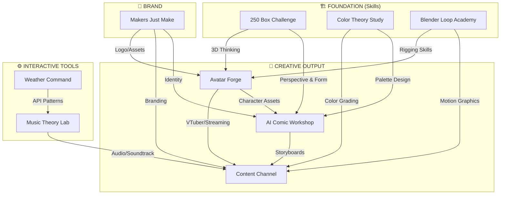
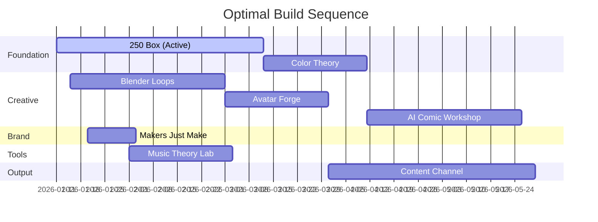

# 🌐 PHLOID CREATIVE ECOSYSTEM
*A Strategic Map of Interconnected Projects*

---

## 🎯 THE VISION
**"Code a million fun things at the drop of a hat."**

Every project feeds into a unified creative pipeline. Skills compound. Tools get reused. Nothing is wasted.

---

## 🗺️ ECOSYSTEM MAP

---

## 📊 PROJECT STATS

| Project | Type | Status | Synergy Score |
|:---|:---|:---|:---:|
| **250 Box** | Skill | 🚧 Active | ⭐⭐⭐⭐⭐ |
| **Color Theory Study** | Skill | ⏳ Pending | ⭐⭐⭐⭐ |
| **Blender Loop Academy** | Skill | ⏳ Pending | ⭐⭐⭐⭐⭐ |
| **Avatar Forge** | Creative/Biz | ⏳ Pending | ⭐⭐⭐⭐⭐ |
| **AI Comic Workshop** | Creative | ⏳ Pending | ⭐⭐⭐⭐ |
| **Content Channel** | Creative/Biz | ⏳ Pending | ⭐⭐⭐⭐⭐ |
| **Music Theory Lab** | Tool/Fun | ⏳ Pending | ⭐⭐⭐ |
| **Makers Just Make** | Brand | ⏳ Pending | ⭐⭐⭐⭐ |

---

## 🔗 KEY SYNERGIES

### **Art Foundation → Everything**
- 250 Box teaches **perspective** → feeds into comic panels, 3D modeling, avatar design
- Color Theory → unlocks **palette consistency** across all visual work

### **Blender → Avatar Forge + Content**
- Ducky3D loops = **motion graphics** for Content Channel
- Rigging practice = **cleaner avatar bones** for Avatar Forge

### **Avatar Forge → Multi-Platform**
- VRChat/VTubing avatars
- Comic character models (3D → 2D reference)
- Content Channel mascots

### **Music Theory Lab → Audio Everywhere**
- Soundtrack tools for Content Channel
- Reuses API patterns from Weather Command (modular code!)

### **Makers Just Make → Brand Glue**
- Logo/splash screen for ALL projects
- Unified visual identity

---

## 🚀 RECOMMENDED EXECUTION ORDER

---

## 💡 THE BOTTOM LINE

| Metric | Value |
|:---|:---|
| **Total Projects** | 8 |
| **Active** | 1 (250 Box) |
| **Skill-Building** | 3 |
| **Revenue Potential** | 3 (Avatar Forge, Content, Music App) |
| **Cross-Project Dependencies** | 12+ synergy links |

**Every hour spent on foundations (250 Box, Color, Blender) multiplies across the entire ecosystem.**

---

*Generated by Pip OS | 2026-01-11 23:07*
