# 🌐 PHLOID CREATIVE ECOSYSTEM
*A Strategic Map of Interconnected Projects*

---

## 🎯 THE VISION
**"Code a million fun things at the drop of a hat."**

Every project feeds into a unified creative pipeline. Skills compound. Tools get reused. Nothing is wasted.

---

## 📊 PROJECT STATS

| Project | Type | Status | Description |
|:---|:---|:---|:---|
| **Weather Wars** | Project | ⏳ Pending | Interim Commander, Morel Fix, Metadata. |
| **Flameborn Garden** | Project | ⏳ Pending | Enshrouded crops, real-time timers, ASMR. |
| **Trench Run** | Project | ⏳ Pending | Star Wars style Retro UI / Targeting Computers. Motion Graphics generator via Web. |
| **Project Aurebesh** | Project | ⏳ Pending | Custom font loading via CDN. Fixed in post. |
| **Blender Bridge** | Project | ⏳ Pending | Python scripting layer to control Blender/Krita from Pip OS. Season 2 Roadmap. |
| **250 Box** | Project | 🚧 Active | Main Focus. Migration & Vibe Check. |
| **NotionLink** | Project | 🪦 Archive | Archived. Replaced by local pip_memory.json + cns.py. |
| **Tech Stack** | Project | ✅ Done | Hardware/Software DB Setup. |
| **Makers Just Make** | Project | ⏳ Pending | Logo/Splash Screen. |
| **Content Channel** | Project | ⏳ Pending | Tarot & Nature Sleep Videos. |
| **Avatar Forge** | Biz | ⏳ Pending | AI-Designed Avatars. Retopology, Optimization, Rigging Service. |
| **AI Comic Workshop** | Project | ⏳ Pending | Graphic Novel / Short Comic Strip. AI-Assisted Storytelling. |
| **Blender Loop Academy** | Skill | ⏳ Pending | Ducky3D Tutorials. Looping Animations. Skill Building. |
| **Color Theory Study** | Project | ⏳ Pending | Art Fundamentals. Palette Building. Overcoming Color Weakness. |
| **Music Theory Lab** | Tool | ⏳ Pending | Interactive App. Fret Trainers, Song Transposers, Theory Games. Guitar/Uke. |
| **Tarot Channel** | Project | ⏸️ On Hold | Friend's project. ON HOLD pending their commitment. |
| **Cinematic Sleep Stories** | Project | ⏳ Pending | 8hr storytelling ambience. Subtle shifts. Fairy in mailbox energy. High-art sleep videos. |
| **Void Typer** | Tool | 🟢 Active | Catharsis web app |
| **Phloid Mail** | Project | ⏳ Pending | Email agent (pip@) |
| **Pip V3** | Project | ⏳ Pending | Gemini File Search RAG |
| **250 Box** | Project | 🚧 Active | Main Focus. Migration & Vibe Check. |
| **NotionLink** | Project | 🪦 Archive | Archived. Replaced by local pip_memory.json + cns.py. |
| **Tech Stack** | Project | ✅ Done | Hardware/Software DB Setup. |
| **Makers Just Make** | Project | ⏳ Pending | Logo/Splash Screen. |
| **Content Channel** | Project | ⏳ Pending | Tarot & Nature Sleep Videos. |
| **Avatar Forge** | Biz | ⏳ Pending | AI-Designed Avatars. Retopology, Optimization, Rigging Service. |
| **AI Comic Workshop** | Project | ⏳ Pending | Graphic Novel / Short Comic Strip. AI-Assisted Storytelling. |
| **Blender Loop Academy** | Skill | ⏳ Pending | Ducky3D Tutorials. Looping Animations. Skill Building. |
| **Color Theory Study** | Project | ⏳ Pending | Art Fundamentals. Palette Building. Overcoming Color Weakness. |
| **Music Theory Lab** | Tool | ⏳ Pending | Interactive App. Fret Trainers, Song Transposers, Theory Games. Guitar/Uke. |
| **Tarot Channel** | Project | ⏸️ On Hold | Friend's project. ON HOLD pending their commitment. |
| **Cinematic Sleep Stories** | Project | ⏳ Pending | 8hr storytelling ambience. Subtle shifts. Fairy in mailbox energy. High-art sleep videos. |
| **Weather Wars** | Tool/Biz | ✅ Live | Gamified weather forecast accuracy tracking (phloid.com) |
| **250 Box Challenge** | Skill | 🚧 Active | Perspective & form drawing fundamentals |
| **Sleep Scape** | Tool/Fun | 💡 Ideation | Interactive ambient sleep scenes (Tent, Beach House, Space Station) |
| **The Speakeasy** | Creative/Fun | 💡 Ideation | Hidden MUD/text adventure ("The Phloid Nightclub") |
| **Vibe Architect Curriculum** | Skill | 💡 Ideation | Learn system architecture without writing code |
| **Local Playwright Automation** | Tool | 💡 Ideation | Automated daily screenshots from local machine |
| **Color Theory Study** | Skill | ⏳ Pending | Palette design for all visual work |
| **Blender Loop Academy** | Skill | ⏳ Pending | Motion graphics + rigging (Ducky3D style) |
| **Avatar Forge** | Creative/Biz | ⏳ Pending | VRChat/VTuber avatar creation service |
| **AI Comic Workshop** | Creative | ⏳ Pending | Comic panel creation with AI assistance |
| **Content Channel** | Creative/Biz | ⏳ Pending | YouTube/streaming content |
| **Music Theory Lab** | Tool/Fun | ⏳ Pending | Interactive music learning app |
| **Makers Just Make** | Brand | ⏳ Pending | Unified brand identity for all projects |
| **Meditation App** | Project | 💡 Ideation | Simple meditation timer/guide. |
| **Phloid Mail** | System | 💡 Ideation | Custom domain (phloid.com) via Fastmail. JMAP for AI agent. |
| **Blind IDE Challenge** | Event | 📅 Tomorrow | Testing skills with unknown IDE/Environment. |
| **Pip V3 (The Brain)** | System | 💡 Ideation | Use Gemini File Search API for master RAG memory. Upload *everything*. |
| **Fastmail Agent** | Tool | 📅 Tomorrow | Assist with inbox organization/archival. |
| **Lock in site changes** | Task | ⏳ Pending | Prep shutdown. |

---

## 🏗️ SITE ARCHITECTURE STRATEGY: "The Junk Drawer"
**Philosophy:** `phloid.com` is a curated chaos. A "Junk Drawer" of apps.
- **Dynamic Ranking:** The most popular/used apps float to the top visually.
- **Discovery:** Users dig through the "drawer" to find hidden gems.
- **Low Friction:** New ideas land in the drawer immediately. Polish comes later.

---

## 🆕 NEW PROJECT IDEAS (Jan 2026 Brainstorm)

### 📥 Phloid Mail (pip@phloid.com)
**Type:** Infrastructure / AI Agent
**Goal:** Auto-managed email presence with personality.
**Requirements:**
- **Infrastructure Options:**
    - *Option A (Free):* Cloudflare Email Workers (Serverless, $0).
    - *Option B (Easy):* Mailgun ($15/mo).
    - *Option C (Hard):* VPS Postfix ($6/mo).
- **Public Auto-Responder:** "The Snark Tank." Pip analyzes incoming public mail and sends contextually snarky replies to trolls/low-effort emails.
- **Ghostwriter:** Pip formats your rambling emails into blog posts.
- **Interface:** No standard webmail. Pip _is_ the client.

---

### 🧘 Meditation App
**Type:** Web App
**Concept:** Minimalist mindfulness tool.
**Vibe:** Calm, grounding, perhaps tied to weather/Sleep Scape.
**Status:** Pure Ideation.

---

### 🕶️ Blind IDE Challenge
**Type:** Skill Event
**Timing:** Tomorrow (2026-01-16).
**Goal:** Stress-test coding adaptability.
**Constraint:** User receives a "Blind" IDE setup. Must build something.

---

### 🌙 Sleep Scape
**Type:** Interactive Web App  
**Concept:** Client-side animated sleep/ambient scenes. No video files—pure code/animation.

**Themes:**
- 🏕️ Tent (Rain Storm)
- 🏖️ Beach House
- 🚀 Space Station (Nebula/Solar Flare)

**Key Features:**
- **Stochastic Loops:** Elements move based on RNG to prevent repetition.
- **Time Sync:** Lighting changes based on user's system time.
- **Diegetic Alarms:** Alarms integrate into the world (e.g., Space Station oxygen purge).
- **Privacy-First:** Local Storage only. Transparent data dashboard.

---

### 🎰 The Speakeasy (Hidden MUD)
**Type:** Secret Community Layer  
**Engine:** Evennia (Python)  
**Access:** Konami Code or hidden glitch trigger opens a terminal overlay.

**Setting:** "The Phloid Nightclub" — Cyberpunk aesthetic.

**Features:**
- NPC AI using cheap API calls (Gemini Flash).
- Text-based now, but architected for future 3D frontend (Godot/Three.js).
- Server sends JSON objects so frontend can be swapped without rewriting backend.

---

### 🏗️ Vibe Architect Curriculum
**Type:** Self-Education  
**Goal:** Master System Architecture without learning low-level code syntax.

**Method:** "Just-in-Time" Learning.
- Pip explains Architectural Patterns (SSOT, Normalization, Caching) *before* generating code.
- Focus on *why* systems are designed a certain way.

**Core Concepts to Learn:**
- Single Source of Truth (SSOT)
- Database Normalization
- Caching Strategies
- API Gateway Patterns
- Load Balancing
- Pub/Sub Messaging

---

### 🤖 Local Playwright Automation
**Type:** Backend Tool  
**Goal:** Automate daily weather website screenshots.

**Constraint:** MUST run locally (desktop/Raspberry Pi) to maintain residential IP.

**Architecture:**
- Script runs on user hardware → visits TV station websites.
- Saves timestamped screenshots to private "Evidence" folder.
- Syncs data to cloud database for Weather Wars scoring.

**Status:** Needs deeper discussion before implementation.

---

### 🎨 Web Design Expert Persona
**Persona:** "The Creative Technologist"

**Core Competency 1: Elegance**
- High-end UI/UX
- Typography, whitespace, "invisible" professional polish
- Perfect mobile responsiveness, fast load times

**Core Competency 2: Whimsy**
- Micro-interactions that delight
- Hidden easter eggs
- Satisfying button clicks
- Dynamic animations

---

### 🛠️ Software Style Guide (PHLOID_STYLE_GUIDE.md)
**Philosophy:** "The Vibe Architect"

- Code must be explained via logic flow first.
- **Data Integrity:** "Rock Solid" validation. Never guess.
- **Communication:** "No Fluff." Direct, honest assessments.
- **Naming:** User prefers `phloid` (lowercase, always).
- **Infrastructure:** Python preferred for backend. System Stability > Speed.

---

## 🗺️ ECOSYSTEM MAP

```mermaid
graph TB
    subgraph FOUNDATION["🏗️ FOUNDATION (Skills)"]
        BOX["250 Box Challenge"]
        COLOR["Color Theory Study"]
        BLENDER["Blender Loop Academy"]
        VIBE["Vibe Architect Curriculum"]
    end

    subgraph CREATIVE["🎨 CREATIVE OUTPUT"]
        COMIC["AI Comic Workshop"]
        AVATAR["Avatar Forge"]
        CONTENT["Content Channel"]
        SPEAKEASY["The Speakeasy (MUD)"]
    end

    subgraph TOOLS["⚙️ INTERACTIVE TOOLS"]
        MUSIC["Music Theory Lab"]
        WEATHER["Weather Wars"]
        SLEEP["Sleep Scape"]
        PLAYWRIGHT["Local Automation"]
    end

    subgraph BRAND["💼 BRAND"]
        MAKERS["Makers Just Make"]
    end

    %% Skill Flows
    BOX -->|"Perspective & Form"| COMIC
    BOX -->|"3D Thinking"| AVATAR
    COLOR -->|"Palette Design"| COMIC
    COLOR -->|"Color Grading"| CONTENT
    BLENDER -->|"Motion Graphics"| CONTENT
    BLENDER -->|"Rigging Skills"| AVATAR
    VIBE -->|"System Design"| WEATHER
    VIBE -->|"Architecture"| SPEAKEASY

    %% Creative Synergies
    AVATAR -->|"Character Assets"| COMIC
    AVATAR -->|"VTuber/Streaming"| CONTENT
    COMIC -->|"Storyboards"| CONTENT

    %% Tool Integration
    MUSIC -->|"Audio/Soundtrack"| CONTENT
    WEATHER -->|"API Patterns"| MUSIC
    WEATHER -->|"API Patterns"| SLEEP
    PLAYWRIGHT -->|"Data Collection"| WEATHER
    SLEEP -->|"Ambient Audio"| MUSIC

    %% Brand Umbrella
    MAKERS -->|"Identity"| COMIC
    MAKERS -->|"Branding"| CONTENT
    MAKERS -->|"Logo/Assets"| AVATAR
    MAKERS -->|"Branding"| WEATHER
```

---

## 🔗 KEY SYNERGIES

### **Art Foundation → Everything**
- 250 Box teaches **perspective** → feeds into comic panels, 3D modeling, avatar design
- Color Theory → unlocks **palette consistency** across all visual work

### **Vibe Architect → All Code Projects**
- Understanding system design makes Weather Wars, Sleep Scape, and Music Lab more robust
- Prevents "Black Box Panic" when debugging

### **Blender → Avatar Forge + Content**
- Ducky3D loops = **motion graphics** for Content Channel
- Rigging practice = **cleaner avatar bones** for Avatar Forge

### **Weather Wars → Everything Technical**
- API patterns reused across Music Lab, Sleep Scape
- Data validation patterns ("Rock Solid") apply everywhere

### **Sleep Scape → Passive Income Potential**
- Client-side animation = low hosting costs
- Ko-fi tiers for custom themes

### **The Speakeasy → Community Building**
- Hidden community layer for superfans
- MUD "Builder" status as Ko-fi perk

---

## 💡 THE BOTTOM LINE

| Metric | Value |
|:---|:---|
| **Total Projects** | 13 |
| **Live** | 1 (Weather Wars) |
| **Active** | 1 (250 Box) |
| **In Ideation** | 5 |
| **Skill-Building** | 4 |
| **Revenue Potential** | 5 (Avatar Forge, Content, Music App, Sleep Scape, Weather Wars) |

**Every hour spent on foundations (250 Box, Color, Blender, Vibe Architect) multiplies across the entire ecosystem.**

---

*Updated by Pip OS | 2026-01-14 20:26*
